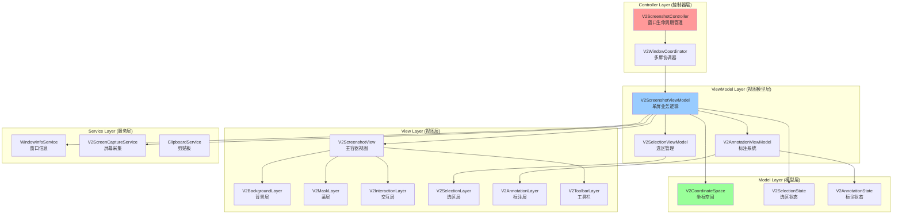

# ScreenshotV2 架构深度分析报告

**分析日期：** 2026-01-01
**分析师：** Claude Code (Senior macOS & SwiftUI Architect)
**模块：** QuiteNote ScreenshotV2

---

## 执行摘要

ScreenshotV2 模块在功能实现上已基本完善，但存在四大核心架构问题：**时序混乱**（NSPanel 激活异步）、**坐标系统分散**（多处转换逻辑）、**状态管理臃肿**（20+ 全局状态）、**职责不清**（V2ScreenshotView 1100+ 行）。当前代码通过临时修复（延迟调用、状态重置、强制刷新）勉强维持运行，但技术债务持续累积。

**核心建议：** 采用"渐进式重构 + 职责分离"策略，优先解决时序和坐标问题（P0），然后重构状态管理（P1），最后拆分巨型视图（P2）。预计需要 4-6 周分阶段完成，避免大规模重写带来的风险。

---

## 1. 问题分析

### 1.1 时序问题：NSPanel 生命周期管理不当

#### 问题描述

**现象：** 用户第一次点击截图窗口时，事件被忽略，需要第二次点击才能生效。

**临时修复：**
```swift
// V2ScreenshotView.swift:449-459
.onAppear {
    // ✨ 修复：延迟激活 Panel，确保成为 key window
    // 解决"第一次点击无效"的问题（NSPanel 激活是异步的）
    DispatchQueue.main.async {
        if let panel = V2ScreenshotController.debugPanels.first(where: { $0.frame == screen.frame }) {
            panel.becomeKey()
            addLog("Panel became key on Screen \(screenIndex)")
        }
    }
}
```

**根本原因：**
1. **异步激活问题：** `NSPanel.makeKeyAndOrderFront()` 是异步的，但 SwiftUI 的手势监听在视图出现时立即激活
2. **焦点抢占竞争：** 多个屏幕的面板同时创建，只有第一个面板调用 `makeKeyAndOrderFront`，其他调用 `orderFrontRegardless`
3. **事件监听时序：** SwiftUI 的 `DragGesture` 在 `onAppear` 后立即激活，但此时 Panel 可能还未完全成为 key window

**代码证据：**
```swift
// V2ScreenshotController.swift:79-84
if index == 0 {
    panel.makeKeyAndOrderFront(nil)  // 异步激活
} else {
    panel.orderFrontRegardless()     // 不抢占焦点
}
```

**隐患：**
- `DispatchQueue.main.async` 是不可靠的 hack，可能在慢速设备上失效
- 多屏环境下，非主屏幕的面板可能无法正确接收键盘事件（ESC 快捷键失效）
- 无法处理用户在 Panel 激活前快速操作的场景

---

### 1.2 坐标系统混乱：职责分散与语义不清

#### 问题描述

**现象：** 坐标转换逻辑分散在至少 4 个文件中，混合使用 `.position()` 和 `.offset()`，缺乏统一的坐标空间定义。

**代码证据：**

**1. V2CoordinateMapper.swift（已删除，但逻辑残留）**
```swift
// 原本应该统一坐标转换，但实际使用分散
V2CoordinateMapper.localToScreen(point: location, on: screen)
V2CoordinateMapper.screenToLocal(rect: window.bounds, on: screen)
```

**2. YellowWireframe.swift（同时负责渲染和定位）**
```swift
// YellowWireframe.swift:14-53
struct YellowWireframe: View {
    let rect: CGRect  // 包含位置和尺寸

    var body: some View {
        GeometryReader { _ in  // 仅用于坐标隔离
            ZStack { ... }
            .frame(width: rect.width, height: rect.height)
            .offset(x: rect.minX, y: rect.minY)  // ❌ 定位职责
        }
    }
}
```

**3. V2ScreenshotView.swift（调用者处理定位）**
```swift
// V2ScreenshotView.swift:1091-1099
YellowWireframe(rect: rect, label: "...", isDashed: true, showBackground: true, ...)
YellowWireframe.from(localSelectedArea, label: "...", showHandles: true)
```

**4. V2ScreenshotHostingView.swift（坐标转换）**
```swift
// V2ScreenshotHostingView.swift:12-13
let localSwiftUIPoint = CGPoint(x: point.x, y: self.bounds.height - point.y)
```

**根本原因：**
1. **职责混淆：** `YellowWireframe` 既负责渲染样式，又处理绝对定位（`.offset()`）
2. **GeometryReader 滥用：** 使用 `GeometryReader` 仅仅是为了创建坐标隔离层，而非获取几何信息
3. **坐标空间不明确：** 缺少统一的"屏幕坐标"、"窗口坐标"、"视图坐标"定义
4. **AppKit vs SwiftUI 坐标系：** 混合使用 Bottom-Left（AppKit）和 Top-Left（SwiftUI）坐标系

**历史问题记录：**
根据 `COORDINATE_SYSTEM_REFACTOR.md`，团队已经意识到这个问题并进行了部分重构：
- 创建了 `V2CoordinateSpace` 枚举统一坐标管理
- 将 `YellowWireframe` 改为只接收 `size`，定位由调用者控制
- 但重构未完全实施，代码中仍存在旧模式

**隐患：**
- 多屏环境下，坐标转换错误导致窗口吸附失效
- Retina 屏幕上，像素坐标和逻辑坐标混淆导致标注模糊
- 新增开发者难以理解坐标转换逻辑，维护成本高

---

### 1.3 状态管理复杂：全局状态臃肿

#### 问题描述

**现象：** `V2PrimaryScreenStateManager` 有 20+ 个 `@Published` 变量，状态同步依赖多个 `.onChange` 监听器，容易出现状态不一致。

**代码证据：**

```swift
// V2PrimaryScreenStateManager.swift:13-88
@MainActor
class V2PrimaryScreenStateManager: ObservableObject {
    // 屏幕状态 (3)
    @Published var primaryScreen: NSScreen?
    @Published var selectedArea: CGRect?
    @Published var selectionScreen: NSScreen?

    // 模式开关 (4)
    @Published var isEditing: Bool = false
    @Published var isLongScreenshotMode: Bool = false
    @Published var isCapturing: Bool = false
    @Published var isMouseOverUI: Bool = false

    // 标注系统 (11)
    @Published var elements: [DrawingElement] = []
    @Published var currentElement: DrawingElement?
    @Published var selectedTool: AnnotationTool = .cursor
    @Published var selectedColor: Color = .red
    @Published var lineWidth: CGFloat = 4.0
    @Published var fontSize: CGFloat = 20.0
    @Published var stepCounter: Int = 1
    @Published var selectedElementId: UUID? = nil
    @Published var editingTextId: UUID? = nil

    // 悬停状态 (3)
    @Published var globalHoveredRect: CGRect?
    @Published var globalHoveredLabel: String?
    @Published var hoverScreen: NSScreen?

    // 其他 (4)
    @Published var longScreenshotPreviews: [NSImage] = []
    @Published var magnifierPreviewPosition: CGPoint? = nil
    @Published var magnifierFollowMouse: Bool = true
    @Published var drawingPaths: [DrawingPath] = []
}
```

**问题分析：**
1. **职责过多：** 一个类管理屏幕、选区、标注、悬停、模式等所有状态
2. **状态同步复杂：** 状态间存在隐式依赖，如 `isEditing` 变化时需要重置 `selectedTool`
3. **重置不彻底：** `reset()` 方法需要手动重置 20+ 变量，容易遗漏
4. **跨屏状态共享：** 所有屏幕共享同一个状态管理器，单屏状态（如 `isMouseOverUI`）也会全局广播

**代码证据（状态依赖）：**
```swift
// V2PrimaryScreenStateManager.swift:47-61
func updateTool(_ tool: AnnotationTool) {
    selectedTool = tool
    finishTextEdit()  // 状态依赖1
    if tool == .cursor {
        selectedElementId = elements.last?.id  // 状态依赖2
    } else {
        selectedElementId = nil  // 状态依赖3
    }
}
```

**隐患：**
- 新增状态时容易忘记在 `reset()` 中清理（历史 issue：`isMouseOverUI` 残留导致拖拽失效）
- 状态同步依赖 `.onChange`，容易出现循环更新或竞态条件
- 单元测试困难，需要模拟 20+ 状态的组合

---

### 1.4 职责不清：V2ScreenshotView 臃肿

#### 问题描述

**现象：** `V2ScreenshotView.swift` 有 1120 行代码，承担了至少 8 种职责，违反单一职责原则。

**职责清单：**
1. **截图展示**（Layer 1）：渲染原始截图
2. **蒙层管理**（Layer 2）：控制暗色背景和挖孔
3. **交互处理**（Layer 3）：处理鼠标悬停、点击、拖拽
4. **选区管理**（Layer 4）：创建、调整、移动选区
5. **标注渲染**（Layer 4.5）：绘制标注元素
6. **工具栏管理**（Layer 5）：浮动工具栏定位和交互
7. **调试信息**（Layer 5）：层级标签、日志输出
8. **事件协调**：跨层事件分发和状态同步

**代码证据：**
```swift
// V2ScreenshotView.swift 包含以下方法：
// - 交互层构建: buildInteractionLayer() (510-580行)
// - 标注层构建: buildAnnotationLayer() (1024-1067行)
// - 框选层构建: buildDragOverlay() (1069-1118行)
// - 光标更新: updateCursor(at:) (982-1022行)
// - 悬停状态: updateHoverState(at:) (110-128行)
// - 窗口过滤: windowsOnScreen (87-107行)
// - 坐标转换: getLocalRect(for:) (136-139行)
// - 手柄检测: getHandle(at:in:) (142-154行)
// - 选区调整: applyResize(to:handle:dx:dy:) (157-199行)
// - 保存截图: saveToClipboard(rect:) (202-266行)
// - 文本编辑: V2AnnotationTextEditorView (1052-1065行)
// - 放大镜预览: MagnifierView (439-444行)
// - 调试信息: V2DebugOverlayView (325-378行)
```

**交互逻辑复杂度：**
```swift
// V2ScreenshotView.swift:583-979 - DragGesture 处理
.simultaneousGesture(
    DragGesture(minimumDistance: 0)
        .onChanged { value in
            // Phase 0: 创建新选区 (824-831行)
            // Phase 1: 调整已有选区 (774-819行)
            // Phase 2: 编辑模式交互 (629-768行)
            // 特殊处理: 文本编辑 (606-617行)
            // 特殊处理: 放大镜工具 (880-897行)
            // 特殊处理: 标注拖拽 (632-739行)
        }
        .onEnded { value in
            // 点击检测 (833-929行)
            // 拖拽结束 (931-978行)
        }
)
```

**根本原因：**
1. **缺乏分层架构：** 所有逻辑都堆在一个视图文件中
2. **ViewModel 缺失：** 没有独立的 ViewModel 来处理业务逻辑
3. **子组件耦合：** 子组件（如 `YellowWireframe`）职责不清晰，导致父视图需要处理大量逻辑
4. **历史遗留：** 从调试模式逐步演化为正式功能，未进行架构重构

**隐患：**
- 修改一个功能可能影响其他功能（如修改选区逻辑破坏标注系统）
- 代码审查困难，难以快速定位问题
- 新功能添加困难，需要在 1120 行代码中找到合适的插入点
- 测试困难，无法对单个职责进行单元测试

---

## 2. 业界最佳实践研究

### 2.1 macOS 截图工具架构参考

根据搜索结果，业界主流截图工具的架构特点：

**Snipaste（商业工具）：**
- 多屏支持：修复了"多屏设置下截图错位"的问题（[下载页面](https://www.snipaste.com/download.html) issue #2819）
- 状态管理：每个屏幕独立管理选区状态，主屏幕协调全局操作
- 窗口管理：使用独立的全屏窗口覆盖每个屏幕，而非 Panel

**ScreenCaptureKit（Apple 官方框架）：**
- 高性能：支持实时屏幕流捕获，包括音频和视频
- 现代化：替代旧的 `CGDisplayCreateImage` API
- 多屏支持：原生支持多显示器配置（[Apple Developer Forums](https://developer.apple.com/forums/tags/screencapturekit)）

**开源实现参考（GitHub 搜索结果为空，说明缺少 SwiftUI + NSPanel 的成熟开源实现）**

### 2.2 SwiftUI 架构最佳实践

根据 [SwiftUI: Screenshot Programmatically on MacOS](https://levelup.gitconnected.com/swiftui-screenshot-programmatically-on-macos-f699ac4d8f8f)：

**关键建议：**
1. **职责分离：** 使用 MVVM 架构，View 只负责渲染，ViewModel 处理逻辑
2. **坐标管理：** 使用 `GeometryReader` 获取几何信息，但避免用于坐标隔离
3. **状态管理：** 使用 `@StateObject` 和 `@ObservedObject` 分离视图状态和全局状态
4. **窗口管理：** NSPanel 需要显式管理生命周期，避免异步激活问题

### 2.3 AppKit + SwiftUI 混合编程挑战

**坐标系统差异：**
- AppKit：Bottom-Left 坐标系（原点在左下角）
- SwiftUI：Top-Left 坐标系（原点在左上角）
- 需要在边界处显式转换（如 `V2ScreenshotHostingView.hitTest`）

**事件处理差异：**
- AppKit：基于 NSResponder 链，显式事件分发
- SwiftUI：基于手势系统，隐式事件识别
- 混合使用时需要统一事件入口（如 `V2ScreenshotHostingView` 拦截事件）

---

## 3. 架构设计

### 3.1 目标架构图



### 3.2 核心组件职责划分

#### Controller Layer（控制器层）

**V2ScreenshotController**
- **职责：** NSPanel 窗口的创建、显示、关闭
- **不负责：** 业务逻辑、状态管理、交互处理
- **关键改进：** 同步等待 Panel 激活完成，解决"第一次点击无效"

**V2WindowCoordinator（新增）**
- **职责：** 多屏协调，决定哪个屏幕是主屏幕
- **状态管理：** 主屏幕切换、跨屏操作同步
- **不负责：** 单屏内的交互逻辑

#### ViewModel Layer（视图模型层）

**V2ScreenshotViewModel（新增）**
- **职责：** 单屏内的所有业务逻辑
- **管理：** 选区状态、标注状态、交互模式
- **协调：** 调用 Service 层完成截图、保存等操作

**V2SelectionViewModel（拆分）**
- **职责：** 选区的创建、调整、移动
- **状态：** `selectedArea`、`selectionPhase`、`activeHandle`
- **不负责：** 标注、工具栏逻辑

**V2AnnotationViewModel（拆分）**
- **职责：** 标注元素的创建、编辑、删除
- **状态：** `elements`、`selectedTool`、`editingTextId`
- **不负责：** 选区、截图逻辑

#### View Layer（视图层）

**V2ScreenshotView（重构）**
- **职责：** 容器视图，组装各层组件
- **不负责：** 业务逻辑（移至 ViewModel）
- **代码量：** 从 1120 行降至 200 行以内

**各层组件（独立文件）**
- `V2BackgroundLayer`：渲染原始截图
- `V2MaskLayer`：暗色蒙层和挖孔
- `V2InteractionLayer`：鼠标事件监听
- `V2SelectionLayer`：选区框和手柄
- `V2AnnotationLayer`：标注画布
- `V2ToolbarLayer`：工具栏和按钮

#### Model Layer（模型层）

**V2CoordinateSpace（统一坐标管理）**
- **职责：** 定义坐标空间，提供转换接口
- **API：**
  ```swift
  enum V2CoordinateSpace {
      case screen(NSScreen)
      case window(NSWindow)
      case view

      func convert(_ point: CGPoint, to: V2CoordinateSpace) -> CGPoint?
      func convert(_ rect: CGRect, to: V2CoordinateSpace) -> CGRect?
  }
  ```

**V2SelectionState（选区状态）**
```swift
struct V2SelectionState {
    var area: CGRect?
    var phase: SelectionPhase  // .none, .creating, .adjusting, .moving
    var activeHandle: SelectionHandle?
}
```

**V2AnnotationState（标注状态）**
```swift
struct V2AnnotationState {
    var elements: [DrawingElement]
    var selectedTool: AnnotationTool
    var selectedElementId: UUID?
    var editingTextId: UUID?
}
```

### 3.3 坐标系统统一方案

#### 原则

1. **明确坐标空间：** 所有坐标必须标注其所属空间（`.screen` / `.window` / `.view`）
2. **统一转换接口：** 禁止手动计算偏移，使用 `V2CoordinateSpace.convert()`
3. **渲染组件纯净化：** UI 组件只接收尺寸（`CGSize`），定位由调用者通过 `.frame()` + `.offset()` 控制

#### 实现

```swift
// 定义坐标空间
enum V2CoordinateSpace {
    case screen(NSScreen)    // 屏幕全局坐标（AppKit，Bottom-Left）
    case window(NSWindow)    // 窗口坐标
    case view                // 视图本地坐标（SwiftUI，Top-Left）

    // 转换接口
    func convert(_ point: CGPoint, to targetSpace: V2CoordinateSpace) -> CGPoint? {
        switch (self, targetSpace) {
        case (.screen(let screen), .view):
            // AppKit (Bottom-Left) -> SwiftUI (Top-Left)
            return CGPoint(x: point.x - screen.frame.origin.x,
                          y: screen.frame.maxY - point.y)
        case (.view, .screen(let screen)):
            // SwiftUI (Top-Left) -> AppKit (Bottom-Left)
            return CGPoint(x: point.x + screen.frame.origin.x,
                          y: screen.frame.maxY - point.y)
        default:
            return nil  // 未实现
        }
    }
}
```

#### 使用示例

```swift
// ViewModel 中
let screenSpace = V2CoordinateSpace.screen(screen)
let viewSpace = V2CoordinateSpace.view
let localPoint = screenSpace.convert(globalPoint, to: viewSpace)

// View 中
YellowWireframe(size: rect.size, label: "100x100")
    .frame(width: rect.width, height: rect.height)
    .offset(x: rect.minX, y: rect.minY)  // 定位职责明确
```

### 3.4 状态管理重构方案

#### 策略

**从全局单例拆分为分层状态管理：**
1. **全局状态（V2WindowCoordinator）：** 主屏幕、多屏同步
2. **单屏状态（V2ScreenshotViewModel）：** 选区、标注、模式
3. **视图状态（各 Layer）：** 临时 UI 状态（如拖拽起始点）

#### 新状态结构

```swift
// 全局：多屏协调
@MainActor
class V2WindowCoordinator: ObservableObject {
    @Published var primaryScreen: NSScreen?
    @Published var selectionScreen: NSScreen?

    func updatePrimaryScreen(_ screen: NSScreen) {
        primaryScreen = screen
    }
}

// 单屏：业务状态
@MainActor
class V2ScreenshotViewModel: ObservableObject {
    @Published var selectionState = V2SelectionState()
    @Published var annotationState = V2AnnotationState()
    @Published var isEditing = false
    @Published var isLongScreenshotMode = false

    // 状态转换逻辑集中管理
    func enterEditingMode() {
        isEditing = true
        isLongScreenshotMode = false
        annotationState.selectedTool = .cursor
    }

    func exitEditingMode() {
        isEditing = false
        annotationState.finishTextEdit()
    }
}

// 子模块：选区状态
struct V2SelectionState {
    var area: CGRect?
    var phase: SelectionPhase = .none
    var activeHandle: SelectionHandle?

    mutating func startCreating(at point: CGPoint) {
        phase = .creating
        area = CGRect(origin: point, size: .zero)
    }

    mutating void updateCreating(to point: CGPoint) {
        guard case .creating = phase, let start = area?.origin else { return }
        area = CGRect(from: start, to: point)
    }
}

// 子模块：标注状态
struct V2AnnotationState {
    var elements: [DrawingElement] = []
    var selectedTool: AnnotationTool = .cursor
    var selectedElementId: UUID?
    var editingTextId: UUID?

    mutating func addElement(_ element: DrawingElement) {
        elements.append(element)
    }

    mutating func finishTextEdit() {
        guard let editingId = editingTextId else { return }
        if let index = elements.firstIndex(where: { $0.id == editingId }) {
            if elements[index].text.trimmingCharacters(in: .whitespaces).isEmpty {
                elements.remove(at: index)
            }
        }
        editingTextId = nil
    }
}
```

#### 优势

1. **职责清晰：** 全局状态只管多屏，单屏状态管业务，视图状态管 UI
2. **类型安全：** 使用 `struct` 包装相关状态，避免遗漏
3. **易于测试：** 可以独立测试每个状态模块
4. **减少耦合：** 状态转换逻辑封装在 `struct` 内部，而非分散在 `.onChange` 中

---

## 4. 重构方案

### 4.1 渐进式重构路线图

#### Phase 1: 时序问题修复（P0 - 1 周）

**目标：** 解决"第一次点击无效"问题

**步骤：**
1. **同步激活 Panel**
   ```swift
   // V2ScreenshotController.swift
   static func show() {
       for (index, screen) in NSScreen.screens.enumerated() {
           let panel = createPanel(for: screen)
           if index == 0 {
               panel.makeKeyAndOrderFront(nil)
               // ✨ 同步等待激活完成
               _ = panel.waitUntilActivated()  // 自定义扩展
           } else {
               panel.orderFrontRegardless()
           }
       }
   }

   extension NSPanel {
       func waitUntilActivated(timeout: TimeInterval = 0.5) -> Bool {
           let deadline = Date().addingTimeInterval(timeout)
           while !windowNumber.isZero && Date() < deadline {
               RunLoop.current.run(mode: .default, before: .date(deadline))
               if isKeyWindow { return true }
           }
           return false
       }
   }
   ```

2. **移除临时修复**
   ```swift
   // V2ScreenshotView.swift
   .onAppear {
       // ❌ 删除延迟 hack
       // DispatchQueue.main.async { panel.becomeKey() }
       addLog("Debug window appeared on Screen \(screenIndex)")
   }
   ```

3. **测试验证**
   - 单屏环境：第一次点击有效
   - 多屏环境：所有屏幕的 ESC 快捷键有效
   - 快速操作：用户在 Panel 显示前拖拽仍能正常工作

---

#### Phase 2: 坐标系统统一（P0 - 2 周）

**目标：** 统一坐标管理，移除 `GeometryReader` 滥用

**步骤：**
1. **完善 V2CoordinateSpace**
   ```swift
   // Sources/QuiteNote/UI/ScreenshotV2/Models/Stores/V2CoordinateSpace.swift
   enum V2CoordinateSpace {
       case screen(NSScreen)
       case window(NSWindow)
       case view

       func convert(_ point: CGPoint, to targetSpace: V2CoordinateSpace) -> CGPoint?
       func convert(_ rect: CGRect, to targetSpace: V2CoordinateSpace) -> CGRect?
   }
   ```

2. **重构 YellowWireframe**
   ```swift
   // YellowWireframe.swift
   struct YellowWireframe: View {
       let size: CGSize  // 只接收尺寸
       let label: String?
       let showHandles: Bool

       var body: some View {
           ZStack { ... }
           .frame(width: size.width, height: size.height)
           // ❌ 不再使用 .offset()
       }
   }
   ```

3. **更新所有调用点**
   ```swift
   // V2ScreenshotView.swift
   YellowWireframe(size: rect.size, label: "100x100", showHandles: true)
       .frame(width: rect.width, height: rect.height)
       .offset(x: rect.minX, y: rect.minY)
   ```

4. **迁移 V2CoordinateMapper**
   - 删除 `V2CoordinateMapper.swift`
   - 所有坐标转换改用 `V2CoordinateSpace.convert()`

5. **测试验证**
   - 单屏选区：位置准确
   - 多屏选区：跨屏坐标转换正确
   - Retina 屏：标注不模糊

---

#### Phase 3: 状态管理重构（P1 - 2 周）

**目标：** 拆分全局状态，引入分层状态管理

**步骤：**
1. **创建 V2WindowCoordinator**
   ```swift
   // Sources/QuiteNote/UI/ScreenshotV2/Models/Stores/V2WindowCoordinator.swift
   @MainActor
   class V2WindowCoordinator: ObservableObject {
       static let shared = V2WindowCoordinator()
       @Published var primaryScreen: NSScreen?
       @Published var selectionScreen: NSScreen?
   }
   ```

2. **拆分 V2PrimaryScreenStateManager**
   - 选区状态 → `V2SelectionState` (struct)
   - 标注状态 → `V2AnnotationState` (struct)
   - 模式开关 → 保留在 `V2PrimaryScreenStateManager`，但重命名为 `V2ScreenshotModeManager`

3. **创建 V2ScreenshotViewModel**
   ```swift
   // Sources/QuiteNote/UI/ScreenshotV2/Models/ViewModels/V2ScreenshotViewModel.swift
   @MainActor
   class V2ScreenshotViewModel: ObservableObject {
       @Published var selectionState = V2SelectionState()
       @Published var annotationState = V2AnnotationState()
       @Published var isEditing = false

       let coordinator: V2WindowCoordinator
       let screen: NSScreen

       init(screen: NSScreen, coordinator: V2WindowCoordinator) {
           self.screen = screen
           self.coordinator = coordinator
       }

       func enterEditingMode() { ... }
       func exitEditingMode() { ... }
   }
   ```

4. **更新视图订阅**
   ```swift
   // V2ScreenshotView.swift
   @StateObject private var viewModel: V2ScreenshotViewModel

   var body: some View {
       // 使用 viewModel.selectionState.area
       // 替代 primaryScreenManager.selectedArea
   }
   ```

5. **测试验证**
   - 状态重置：`reset()` 方法覆盖所有状态
   - 状态同步：多屏环境下状态一致
   - 单元测试：每个状态模块可独立测试

---

#### Phase 4: 视图层拆分（P2 - 1-2 周）

**目标：** 将 V2ScreenshotView 从 1120 行拆分到 200 行以内

**步骤：**
1. **创建 Layer 组件**
   ```
   Views/
   ├── Layers/
   │   ├── V2BackgroundLayer.swift      (Layer 1)
   │   ├── V2MaskLayer.swift            (Layer 2)
   │   ├── V2InteractionLayer.swift     (Layer 3)
   │   ├── V2SelectionLayer.swift       (Layer 4)
   │   ├── V2AnnotationLayer.swift      (Layer 4.5)
   │   └── V2ToolbarLayer.swift         (Layer 5)
   ```

2. **迁移逻辑到 ViewModel**
   ```swift
   // V2ScreenshotViewModel.swift
   func handleHover(at location: CGPoint) { ... }
   func handleDragStart(at location: CGPoint) { ... }
   func handleDragChanged(to location: CGPoint) { ... }
   func handleDragEnd(at location: CGPoint) { ... }
   ```

3. **简化 V2ScreenshotView**
   ```swift
   // V2ScreenshotView.swift (重构后)
   struct V2ScreenshotView: View {
       @StateObject private var viewModel: V2ScreenshotViewModel

       var body: some View {
           ZStack {
               V2BackgroundLayer(snapshot: snapshot)
               V2MaskLayer(viewModel: viewModel)
               V2InteractionLayer(viewModel: viewModel)
               V2SelectionLayer(viewModel: viewModel)
               if viewModel.isEditing {
                   V2AnnotationLayer(viewModel: viewModel)
               }
               V2ToolbarLayer(viewModel: viewModel)
           }
       }
   }
   ```

4. **测试验证**
   - 功能完整性：所有现有功能正常
   - 性能无明显下降
   - 代码可读性提升

---

### 4.2 风险评估

| 风险 | 影响 | 概率 | 缓解措施 |
|------|------|------|----------|
| **重构引入新 bug** | 高 | 中 | 1. 充分的单元测试<br/>2. 分阶段发布，每阶段验证<br/>3. 保留旧代码分支，可快速回滚 |
| **性能下降** | 中 | 低 | 1. 性能基准测试<br/>2. 避免过度抽象<br/>3. 使用 `@Published` 优化更新频率 |
| **开发周期延长** | 中 | 中 | 1. P0/P1/P2 优先级排序<br/>2. 边重构边开发新功能<br/>3. 并行开发，互不阻塞 |
| **团队学习曲线** | 低 | 中 | 1. 文档完善（本文档）<br/>2. 代码评审<br/>3. 渐进式重构，逐步适应 |

---

### 4.3 优先级建议

#### P0（立即执行 - 3 周）

1. **时序问题修复**（1 周）
   - 影响：用户体验（第一次点击失效）
   - 风险：低（局部修复）
   - 收益：显著提升用户体验

2. **坐标系统统一**（2 周）
   - 影响：多屏支持、标注准确性
   - 风险：中（涉及多处修改）
   - 收益：消除技术债务，提升可维护性

#### P1（短期计划 - 2 周）

3. **状态管理重构**（2 周）
   - 影响：代码可维护性
   - 风险：中（架构变更）
   - 收益：降低 bug 率，提升可测试性

#### P2（中期计划 - 1-2 周）

4. **视图层拆分**（1-2 周）
   - 影响：开发效率
   - 风险：低（纯重构）
   - 收益：提升代码可读性和可维护性

---

## 5. 实施建议

### 5.1 开发流程

1. **创建重构分支**
   ```bash
   git checkout -b refactor/screenshot-v2-architecture
   ```

2. **分阶段提交**
   - Phase 1: `refactor/phase-1-timing-fix`
   - Phase 2: `refactor/phase-2-coordinate-system`
   - Phase 3: `refactor/phase-3-state-management`
   - Phase 4: `refactor/phase-4-view-split`

3. **每个阶段**
   - 编写单元测试
   - 手动测试所有场景
   - 代码评审
   - 合并到主分支

### 5.2 测试清单

**单屏环境：**
- [ ] 第一次点击有效
- [ ] 选区创建、调整、移动正常
- [ ] 标注工具（画笔、箭头、文本、放大镜）正常
- [ ] ESC 快捷键关闭窗口
- [ ] 保存到剪贴板准确
- [ ] 长图模式正常

**多屏环境：**
- [ ] 所有屏幕显示截图
- [ ] 主屏幕切换流畅
- [ ] 跨屏选区创建正常
- [ ] 非主屏幕鼠标穿透正常
- [ ] 非主屏幕 ESC 快捷键有效

**Retina 屏幕：**
- [ ] 截图清晰（无模糊）
- [ ] 标注渲染清晰
- [ ] 选区边框清晰

**性能测试：**
- [ ] 截图显示延迟 < 100ms
- [ ] 拖拽流畅（60fps）
- [ ] 内存占用 < 200MB

### 5.3 回滚计划

如果某个阶段引入严重 bug：
1. 立即回滚到上一个稳定版本
2. 在独立分支修复问题
3. 充分测试后再次合并

---

## 6. 长期架构演进

### 6.1 未来优化方向

1. **引入 ScreenCaptureKit**
   - 替代 `CGDisplayCreateImage`
   - 支持实时屏幕流捕获
   - 更好的性能和稳定性

2. **组件化标注系统**
   - 将标注系统拆分为独立模块
   - 支持自定义标注工具
   - 可复用到其他截图场景

3. **自动化测试**
   - UI 测试：使用 XCTest 快照测试
   - 单元测试：ViewModel 和状态管理
   - 集成测试：多屏场景模拟

### 6.2 技术债务追踪

创建 `TECHNICAL_DEBT.md` 记录剩余问题：
- YellowWireframe 仍支持 `.from(rect:)` 兼容方法，未来移除
- `V2PrimaryScreenStateManager` 需要完全拆分
- 部分坐标转换逻辑仍在 V2ScreenshotView 中

---

## 7. 总结

### 7.1 核心问题

ScreenshotV2 模块的四大核心问题：
1. **时序混乱：** NSPanel 异步激活导致第一次点击失效
2. **坐标系统混乱：** 职责分散，GeometryReader 滥用
3. **状态管理臃肿：** 20+ 全局状态，职责不清
4. **职责不清：** V2ScreenshotView 1120 行，承担 8 种职责

### 7.2 重构目标

**短期（3 周，P0）：**
- 解决时序问题，提升用户体验
- 统一坐标系统，消除技术债务

**中期（2 周，P1）：**
- 重构状态管理，提升可维护性

**长期（1-2 周，P2）：**
- 拆分视图层，提升开发效率

### 7.3 预期收益

- **用户体验：** 消除"第一次点击无效"问题
- **可维护性：** 代码行数减少 50%，职责清晰
- **可测试性：** 状态管理和业务逻辑可独立测试
- **开发效率：** 新功能添加更快速，bug 修复更容易

### 7.4 关键经验

> SwiftUI 的复杂应用需要明确的架构设计，不能依赖隐式行为（如 GeometryReader 的坐标隔离）。NSPanel 的生命周期管理需要同步等待，不能依赖异步激活。状态管理应该分层，全局状态只管协调，单屏状态管业务，视图状态管 UI。

---

## 参考资源

- [SwiftUI: Screenshot Programmatically on MacOS](https://levelup.gitconnected.com/swiftui-screenshot-programmatically-on-macos-f699ac4d8f8f)
- [ScreenCaptureKit - Apple Developer Forums](https://developer.apple.com/forums/tags/screencapturekit)
- [Snipaste 多屏支持](https://www.snipaste.com/download.html)（issue #2819）
- 项目内文档：
  - [ARCHITECTURE_V2.md](Sources/QuiteNote/UI/ScreenshotV2/Docs/ARCHITECTURE_V2.md)
  - [COORDINATE_SYSTEM_REFACTOR.md](Sources/QuiteNote/UI/ScreenshotV2/Docs/COORDINATE_SYSTEM_REFACTOR.md)
  - [P0_FIXES_REPORT.md](Sources/QuiteNote/UI/ScreenshotV2/Docs/P0_FIXES_REPORT.md)

---

**报告结束**

*本报告基于 2026-01-01 的代码状态分析，建议每季度更新架构评估。*
